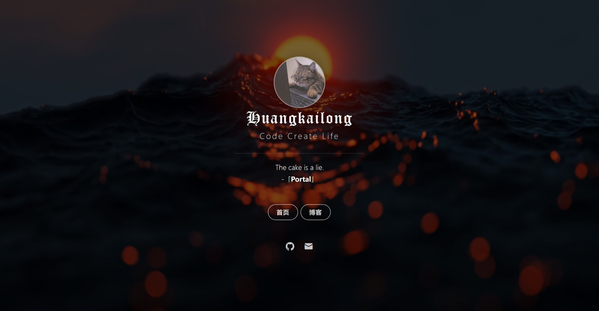

# 个人主页

- 基于 [Dmego](https://github.com/dmego/home.github.io) 项目修改并添加视频背景
- 在线预览 [homepage](https://www.huangkailong.com)

# 效果图

> 静态图片



> 动态图片
 


# 配置背景图类型

配置文件在 `./assets/js/config.js` 路径下，配置说明如下：

```js
// 可选的背景, video_wallpaper:视频背景, bing_wallpaper 必应壁纸
const backgroundType = "video_wallpaper";
// 视频背景的视频源
const backgroundVideoUrl = './assets/video/background.mp4';
// 视频背景的视频封面
const backgroundVideoCoverUrl = './assets/video/background_cover.jpg';
// 是否启用视频背景的视频封面
const enableBackgroundVideoCover = true;
```

其他情况请参考 [Dmego](https://github.com/dmego/home.github.io) README。


